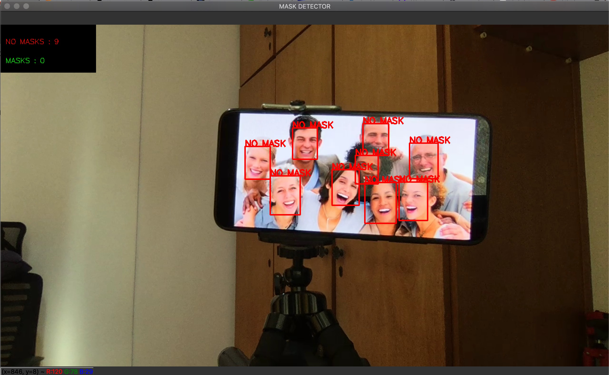

# DEEP LEARNING PARA O RECONHECIMENTO DO USO DE MÁSCARA DE PROTEÇÃO FACIAL

Projeto Analítico de conclusão do curso de MBA Business Analytics e Big Data na Fundação Getúlio Vargas (FGV). 

 Em vista da atual pandemia mundial e as mudanças em ambientes sociais, este projeto propõe o uso de uma rede neural convolucional profunda, VGG19, para a detecção do uso de máscaras faciais protetoras para auxiliar na prevenção da propagação da COVID-19. 

Alguns resultados positivos obtidos com o projeto, como o reconhecimento facial de um grupo de pessoas sem máscara e o reconhecimento facial de pessoas de sexo diferentes usando a máscara. Outros resultados, podem ser visto no arquivo em *Deep Learning para o Reconhecimento do Uso de Mascara de Proteção Facial.pdf* disponibilizado nesse repositório. 

 

 

## Instalação

Este projeto foi  desenvolvido utilizando Python 3.x , TensorFlow 2.x, Opencv 4.x e MTCNN. 
Este documento descreve o processo de instalação utilizando o pip, caso esteja utilizando o conda pesquise como instalar os requirements na documentação do conda. 

    pip install pip --upgrade
    pip install -r requirements.txt

## Como executar

Para executar os scripts localmente é necessário estar localizado dentro do diretório do projeto. 

    cd <diretorio do projeto>

### Download das imagens
O script **download_imagens.py** é para aplicar o web scraping e fazer o download das imagens através do site de busca [https://images.google.com](https://images.google.com/?gws_rd=ssl).

    python download_imagens.py <diretorio output> <url images.google.com>

### Criando o modelo
Para executar o arquivo **detector_mask.ipynb** é recomendável o uso do Google Colab, sendo necessário o uso da GPU, do contrário o processamento da rede neural será lento. 

O Google Drive cria uma pasta específica para salvar os notebooks que se chama Colab Notebooks, nele você deverá salvar o arquivo *detector_mask.ipynb* e o conjunto de dados. 

O conjunto de dados com as imagens está disponibilizado no repositório, faça o download da pasta e salve no diretório do Colab Notebook. 

Caso contrário, poderá utilizar o script anterior *download_imagens.py* para criar seu próprio conjunto de imagens. 

Para validar o modelo usando o colab notebook, poderá ser usado a imagem nomeada de *img_1.jpg* disponibilizada no repositório. 

Caso utilize o Jupyter Notebook será necessário que seu computador possua a GPU nVIDIA. 

### Aplicação de reconhecimento
Para a execução do modelo usando a webcam utilize o script **webcam_mask_detector.py**, lembre-se de informar o path do seu modelo no script. 

*Caso tenha utilizado o Google Colab  será necessário fazer o download do modelo.*

Nessa etapa é necessário que tenha uma webcam instalada e configurada no computador.

    python webcam_mask_detector.py

**PS: Para interromper o programa aperte a tecla "q".**
